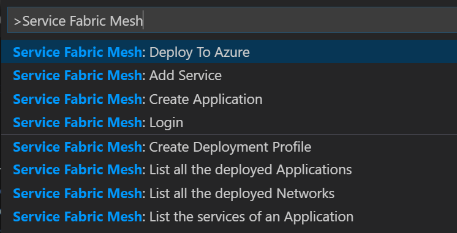

# Service Fabric Extension for Visual Studio Code

A [Visual Studio Code](https://code.visualstudio.com/) extension that provides support for building and deploying Service Fabric Mesh applications in Visual Studio Code.

## Features

* Create Service Fabric Mesh applications from container image
* Create Service Fabric Mesh deployment profile
* Login to Azure
* Deploy Service fabric mesh applications to Azure
* List the deployed applications



## Requirements

As VS Code is a lightweight editor, a number of dependencies must be first installed before Service Fabric applications can be created using VS Code.

* [Install Visual Studio Code](https://code.visualstudio.com/)
* [Install Node.js](https://nodejs.org/en/)
* [Install Azure CLI](https://docs.microsoft.com/en-us/cli/azure/install-azure-cli?view=azure-cli-latest)
* [Install Git](https://git-scm.com/)
* Install Yeoman Generators
```sh
npm install -g yo
npm install -g generator-azuresfmesh
```

## Quickstart

### Setup

1. Open the VS Code application.
2. Click on the extension icon in the explorer. Search for Service Fabric. Click install for the Service Fabric Mesh extension.

### Commands
The Service Fabric Mesh extension for VS Code helps developers to create and deploy Service Fabric Mesh projects using many commands. Commands can be called pressing (Ctrl + Shift + p), typing the command name into the input bar, and selecting the desired command for the prompt list.

* **Service Fabric Mesh: Create Application** (the command creates the mesh template and deployment profile)
* **Service Fabric Mesh: Add Service** (the command adds a new service to an existing Service Fabric Mesh application)
* **Service Fabric Mesh: Generate deployment profile** (from template file or uri)
* **Service Fabric Mesh: Login**
* **Service Fabric Mesh: Deploy To Azure** (the command creates the resource group if needed)
* **Service Fabric Mesh: List the deployed applications**

### Deployment profile
The deployment profile (deploy/deployment.json) can be created with the application **Service Fabric Mesh: Create Application** or with the standalone command **Service Fabric Mesh: Generate deployment profile**.
The default generated parameters can be overrided with the extension configuration (see 'Configuration' chapter).
Once generated, the deployment parameters can be changed (subscriptionId, resourceGroup, etc.) before using the **Service Fabric Mesh: Deploy To Azure** command.

### Configuration 
* Set config **sf-mesh-tools.defaultSubscriptionId** to fill deployment profile automatically
* Set config **sf-mesh-tools.defaultResourceGroup** to fill deployment profile automatically
* Set config **sf-mesh-tools.defaultTemplateUri** to fill deployment profile automatically
* Set config **sf-mesh-tools.defaultTemplateFile** to fill deployment profile automatically
* Set config **sf-mesh-tools.defaultParameters** to fill deployment profile automatically

## Changelog

See [CHANGELOG.md](CHANGELOG.md)